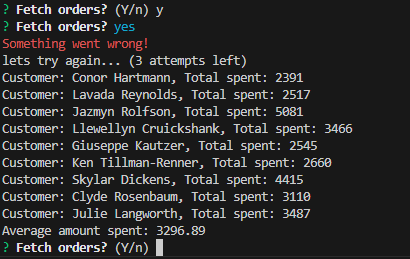

# order-calculator

order-calculator - [Github Repo](https://github.com/Ryocon/order-calculator)
Deployed - [Github Pages]()

  ## Table of Contents
  - [Description](#description)
  - [Installation](#installation)
  - [Screenshots](#screenshots)
  - [Challenges](#challenges)
  - [Future Developments](#future)
  - [Tests](#tests)
  - [License](#license)
  - [Credits](#credits)
  - [Questions](#questions)
  

  ## Description
  This project uses an API that generates randomised customers, items and prices each time it is accessed. The app then pulls the data and displays each customers total spend and calculates the average spend per customer. The app runs on throguh the terminal using Node.js and the inquirer package to allow the user to repeat the prompt for new results.

  ## Installation
  The project will need to be downloaded where the command `npm install` will need to be ran to install the dependencies required.
  Nodemon is listed as a dependency but is not required for the project to run and was used for development only.

  ## Screenshots
  

  ## Challenges
  The first issue with building this was the CORS and then CORB errors from using vanilla JavaScript to access the API. A cURL request returned the data as plain text, both Insomnia and Postman were able to pull from the API just fine also. There were a few work arounds or solutions to choose from and I chose to create a local server using node.js to run the API from there. From there I was able to pull the data form the API as a JSON.

  Another interesting challenge was the API throwing an error around 1/10 calls. The script still calculated the average amount spent per customer but an error would being thrown would not show that the code runs well. A solution for this was building in an automatic retry system for the Promise if it was not returned. This then shows the user on the terminal something went wrong but it is retrying without user intervention. It has 3 retry attempts built in so if it does not work there may actually be a problem with the server!

  ## Future Developments
  I would like to add a front end element to the project. It would be nice to display each customer as a card then generates dynamically on each API call.

  ## License
  This project uses the MIT license.

  ## Credits
  There were no additional collaborators for this project.

  ## Tests
  There are no tests available for this project.

  ## Questions
  For any questions please contact via Github or email.

  Github - https://github.com/Ryocon

  Email - roconn25@gmail.com